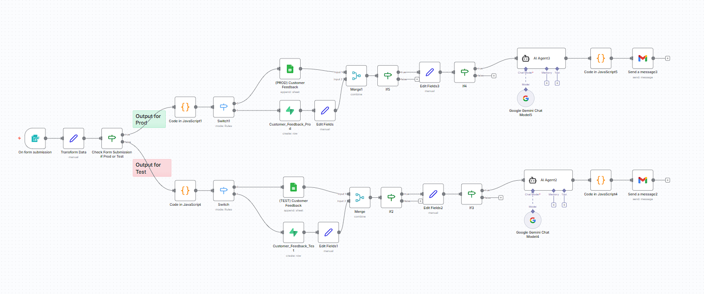
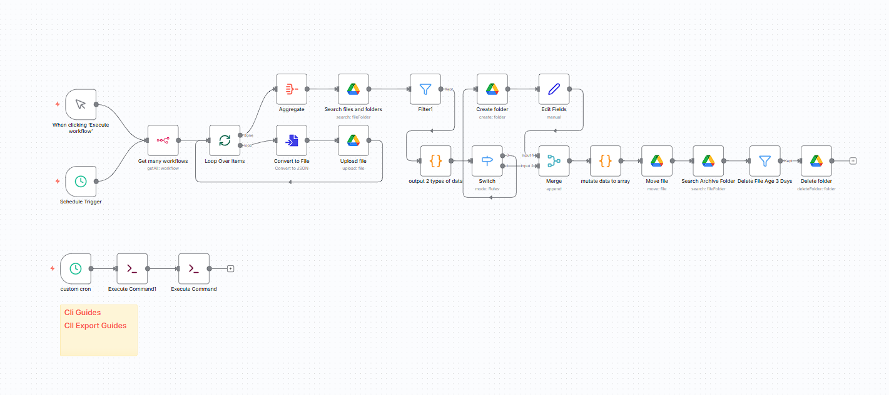

# MY-N8N-WORKFLOW
A collection of my n8n workflow

## ( ´ ∀ ` )ﾉ Purpose on Building
( ﾟヮﾟ) This repo is part of my automation practice and portfolio.  
(＠_＠;) I use it to explore automation tasks.  
(￣▽￣*)ゞ These workflows help streamline repetitive tasks and experiment with automation ideas.  


## Prerequisites (°ロ°)☝
- [Docker Desktop](https://www.docker.com/products/docker-desktop//)

### Running N8N (⌐■_■)
To start the n8n services, run:
``` bash
docker compose up -d
# -d for detach, no linux magic happens
```

### For window users
### Add Local domain to window host file (ಠ_ಠ)
``` bash
C:\Windows\System32\drivers\etc\host

# add
127.0.0.1 n8n.<your-host-name>.com
```


## Following ENV's (O_O;) 

``` bash

# DOMAIN_NAME and SUBDOMAIN together determine where n8n will be reachable from
# The top level domain to serve from
DOMAIN_NAME=<host-name-here>.com

# The subdomain to serve from
SUBDOMAIN=n8n

# The above example serve n8n at: https://n8n.example.com

# Optional timezone to set which gets used by Cron and other scheduling nodes
# New York is the default value if not set
GENERIC_TIMEZONE=Asia/Manila # change to your Time Zone

# The email address to use for the TLS/SSL certificate creation
SSL_EMAIL=<your-email@google.com>

```

#### Customer Feedback Workflow
``` bash
# Project Setting > Data Api > Project URL
SUPERBASE_HOST=<host-url>
# Project Setting > API Keys > service_role > reveal
SUPERBASE_SERVICE_ROLE=<service-role-key>

# https://console.cloud.google.com/apis/credentials
GOOGLE_CLIENT_ID=<client-id>
GOOGLE_CLIENT_SECRET=<client-secret>

#LLM
GEMINI_API_KEY=<api-key>
```

#### Workflow Backup
``` bash

# N8N API KEY
# Profile Icon > Settings > n8n API > create an api key
N8N_API_KEY=<n8n-api-key>

# https://console.cloud.google.com/apis/credentials
GOOGLE_CLIENT_ID=<client-id>
GOOGLE_CLIENT_SECRET=<client-secret>
```


## Workflows (´｡• ᵕ •｡`)

### Customer Feedback


### Workflow Backup
